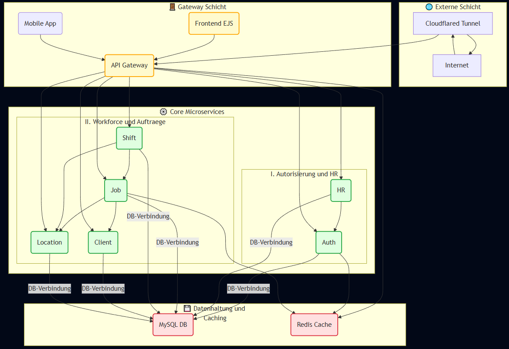

# DRP2 - Ein skalierbares Microservices-System auf Kubernetes



## Inhaltsverzeichnis
* [Über DRP2](#über-drp2)
* [Projektübersicht & Design-Philosophie](#projektübersicht--design-philosophie)
* [Architektur](#architektur)
    * [Bestehende Microservices](#bestehende-microservices)
    * [Spezial-Features (ArbZG & Steuer)](#spezial-features-arbzg--steuer)
* [Technologien](#technologien)
* [Setup & Installation](#setup--installation)
* [API-Dokumentation](#api-dokumentation)
* [GitHub Workflow](#github-workflow)

---

## Über DRP2
DRP2 ist ein umfassendes, voll funktionsfähiges Microservices-System, das als Managementsupportsystem für verschiedene Unternehmensfunktionen konzipiert wurde. Es demonstriert eine moderne Cloud-Native-Architektur, die auf Skalierbarkeit, Ausfallsicherheit und einfache Wartbarkeit ausgelegt ist. Das Projekt dient als praxisnahe Fallstudie für die Migration von monolithischen zu verteilten Systemen und die Orchestrierung komplexer Anwendungen mittels Kubernetes.

## Architektur
DRP2 besteht aus **13+ unabhängigen Microservices**, die über ein zentrales API Gateway kommunizieren. Die Dienste werden in Docker-Containern betrieben und auf **Kubernetes** orchestriert.

### Bestehende Microservices
* **Auth Service:** Authentifizierung (JWT), Rollenmanagement und Benutzerverwaltung.
* **HR Service:** Verwaltung aller Mitarbeiterdaten (Verträge, Adressen, Bankdetails, Notfallkontakte).
* **Payroll Service:** Hochpräzise Gehaltsabrechnung. Integriert HR- und Schichtdaten für Brutto-/Netto-Berechnungen.
* **Shift Service:** Erfassung von Arbeitszeiten, Check-in/out Funktionalität und Schichtplanung.
* **Location Service:** Verwaltung von Einsatzorten und Firmenstandorten inkl. NFC-Validierung.
* **Tax Engine (C++):** Der technische Kern für steuerliche Berechnungen. Er implementiert den offiziellen deutschen Programmablaufplan (PAP) in hochperformantem C++.
* **File Storage:** Zentraler Dienst für Dokumenten-Management (Abrechnungen, Uploads) via Rclone/S3.
* **Frontend EJS:** Modernes User-Interface auf Basis von EJS und Tailwind CSS.

### Deep Dive: Tax Engine (C++)
Die **Tax Engine** nimmt eine Sonderrolle im DRP2-Stack ein. Während die meisten Services in Node.js geschrieben sind, wurde die Rechenlogik für Steuern bewusst in **C++** implementiert:
* **Präzision:** Direkte Umsetzung der hochkomplexen mathematischen Formeln des Bundesfinanzministeriums (PAP 2026).
* **Performance:** Blitzschnelle Berechnung ganzer Abrechnungsläufe durch vorkompilierten Code.
* **Sicherheit:** Kapselung der kritischen Finanzlogik in einem spezialisierten Dienst.
* **Integration:** Der Payroll-Service kommuniziert via interner REST-API mit der Engine, übergibt Bruttowerte sowie Steuermerkmale und erhält in Millisekunden den exakten Abzug-Breakdown (LSt, Soli, KiSt, SV-Anteile).

### Spezial-Features (ArbZG & Steuer)
Das System erfüllt strenge gesetzliche Anforderungen:
* **ArbZG-Compliance:** Automatische Pausenabzüge (30/45 Min) und Überwachung der 11h-Ruhezeit.
* **7,5h-Regel:** Automatische Ermittlung täglicher Überstunden für flexible Arbeitszeitmodelle.
* **SFN-Zuschläge:** Rechtssichere Berechnung von Sonntags-, Feiertags- und Nachtzuschlägen nach § 3b EStG.
* **PDF-Abrechnung:** Dynamische Generierung professioneller Gehaltsabrechnungen im DIN 5008 Format.

## Technologien
* **Core:** Node.js (Express), C++ (Tax Engine)
* **Storage:** MySQL (MariaDB), Redis (Caching)
* **DevOps:** Docker, Kubernetes, Helm, Cloudflare Tunnel
* **Tools:** Sequelize ORM, Moment-Timezone, PDFKit, Rclone

## Setup & Installation
1. **Repo klonen:** `git clone https://github.com/xheen908/DRP2.git`
2. **Umgebung:** `.env` im Hauptverzeichnis nach Vorlage erstellen.
3. **Start:** `docker-compose up -d --build`
4. **Initialisierung:** Die Datenbanken werden automatisch über das `init-all-dbs.sql` Skript beim ersten Start von MySQL konfiguriert.

## API-Dokumentation
Detaillierte Informationen zu den einzelnen Schnittstellen:
* **Tax Engine API (C++):** [Vollständige API Dokumentation](./tax-engine-cpp/README.md)
* **Payroll Service:** [Abrechnungs-Logik](./payroll-service/README.md)
* **Cloudflare Tunnel:** Konfiguration erfolgt via `cloudflared` Container und Zero Trust Dashboard.

## GitHub Workflow
Standard-Workflow für Änderungen:
```bash
git add .
git commit -m "Beschreibung der Änderung"
git push origin main
```

---
*Status: Februar 2026* ^^
